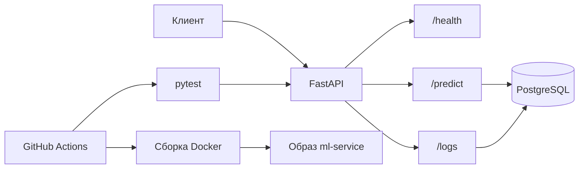

# ML Service

FastAPI сервис для предсказаний с логированием запросов в PostgreSQL.

## Установка и запуск

### Через Docker Compose


```bash
docker-compose up --build
```

### Локально
```bash
pip install -r requirements.txt
python -m uvicorn app.app:app --reload
```

## Переменные окружения
Необходим файл `.env` со следующим содержимым:
```env
PGPASSWORD=your_password
DB_HOST=localhost
```

## Эндпоинты
| Метод | Путь | Описание |
|-------|------|----------|
| GET | `/health` | Проверка статуса сервиса |
| POST | `/predict` | Предсказание по признакам |
| GET | `/logs` | Последние 10 записей логов |

### Пример запроса `/predict`
```json
{
  "features": [5.1, 3.5, 1.4, 0.2]
}
```

### Пример ответа
```json
{
  "prediction": 0,
  "confidence": 0.95,
  "processing_time_ms": 1.23
}
```

## Тесты
```bash
docker-compose exec app pytest my_tests/ -v
```

## CI/CD
GitHub Actions запускает тесты и сборку Docker при каждом пуше в ветку `master`.

## Структура проекта
```
.
├── app/
│   ├── app.py
│   └── schemas.py
├── my_tests/
├── model.joblib
├── scaler.joblib
├── requirements.txt
├── Dockerfile
├── docker-compose.yml
└── README.md
```

## Упрощённая визуализация архитектуры сервиса

