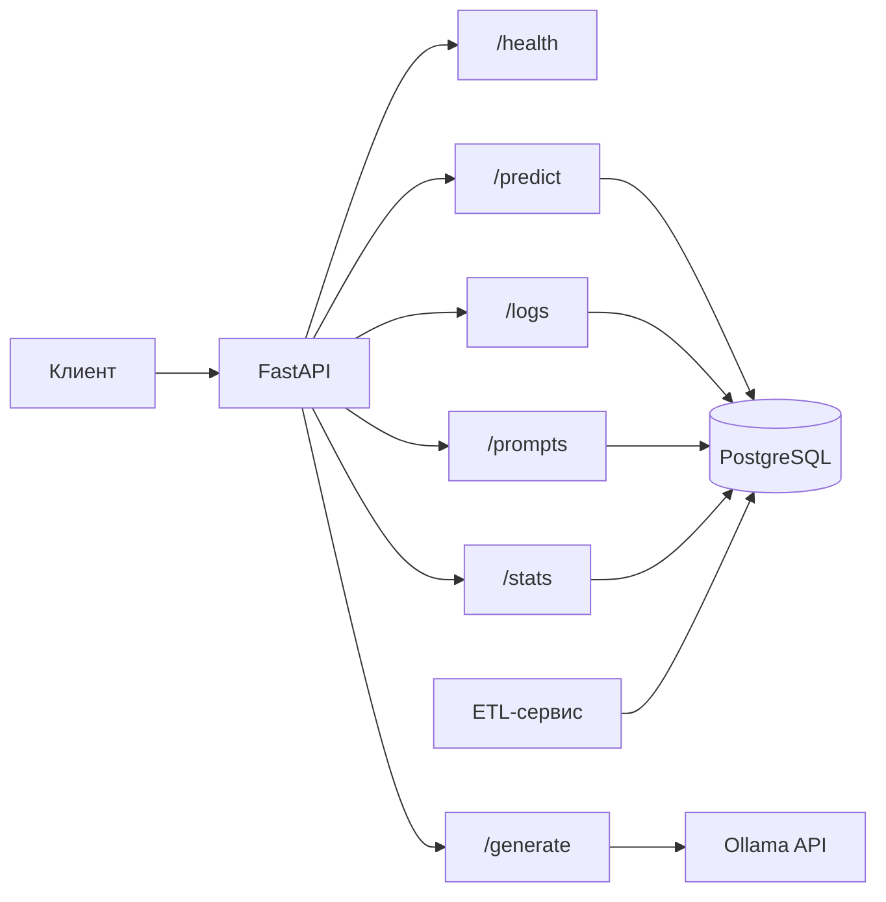

# ML Service v2

Версия **v2** сервиса машинного обучения на **FastAPI** с поддержкой:
- **ETL-сервиса** для автоматического сбора ежедневной статистики.
- **Логирования запросов** в PostgreSQL.
- **Генерации текста** через Ollama.
- **Модульной архитектуры** с выделенными роутерами.

---

## Установка и запуск

### Через Docker Compose (рекомендуемый способ)

```
docker-compose up --build
```

Сервис будет доступен по адресу: `http://localhost:8000`

### Локальный запуск (без Docker)

1. Установите зависимости:
```
pip install -r requirements.txt
```

2. Запустите сервер:
```
python -m uvicorn src.main:app --reload
```

### Запуск готового образа из GitHub Container Registry

```
docker pull ghcr.io/avandrevv/ml-service:latest
docker run -p 8000:8000 ghcr.io/avandrevv/ml-service:latest
```

> **Важно:** при запуске образа вручную требуется **запущенный PostgreSQL**. При локальном запуске FastAPI может работать без БД (логирование будет отключено).

---

## Переменные окружения

Создайте файл `.env` в корне проекта:

```
PGPASSWORD=your_password
```

---

## Эндпоинты API

| Метод | Путь | Описание |
|-------|------|----------|
| `GET` | `/health` | Проверка статуса сервиса |
| `POST` | `/predict` | Предсказание по входным признакам |
| `POST` | `/generate` | Генерация текста через Ollama |
| `GET` | `/logs` | Последние 10 записей логов |
| `GET` | `/prompts` | Получение истории prompt-запросов |
| `GET` | `/stats` | Статистика использования (ETL) |

### Примеры запросов

**/predict**

```
{
  "features": [5.1, 3.5, 1.4, 0.2]
}
```

Ответ:

```
{
  "prediction": 0,
  "confidence": 0.95,
  "processing_time_ms": 1.23
}
```

**/generate**

```
{
  "prompt": "Hi, I'm Andrew and how is your name",
  "model": "tinyllama"
}
```

Ответ:

```
{
  "model": "tinyllama",
  "response": "Hello Andrew! I am an AI assistant.",
  "done": true
}
```

---

## Тестирование

```
docker-compose exec app pytest my_tests/ -v
```

---

## CI/CD

GitHub Actions автоматически:
- Запускает тесты при каждом пуше в ветку `master`.
- Собирает Docker-образ и публикует его в GitHub Container Registry.

---

## Структура проекта

```
.
├── src/
│   ├── main.py                 # Точка входа FastAPI
│   ├── database.py             # Подключение к БД
│   └── routers/
│       ├── db_routes.py        # Эндпоинты /logs, /prompts, /stats
│       └── prompt_routes.py    # Эндпоинты /predict, /generate
├── etl/
│   ├── Dockerfile.etl          # Сборка ETL-сервиса
│   ├── etl_service.py          # Логика сбора статистики
│   └── requirements.txt        # Зависимости ETL
├── my_tests/                   # Тесты
├── model.joblib                # Обученная модель
├── scaler.joblib               # Scaler для предобработки
├── Dockerfile                  # Многостадийная сборка основного сервиса
├── Dockerfile.ollama           # Сборка Ollama
├── docker-compose.yml          # Оркестрация всех сервисов
├── requirements.txt            # Зависимости основного сервиса
└── README.md
```

---

## Архитектура сервиса


```mermaid
graph LR
    A[Клиент] --> B[FastAPI]
    B --> C["/health"]
    B --> D["/predict"]
    B --> E["/generate"]
    B --> F["/logs"]
    B --> G["/prompts"]
    B --> H["/stats"]
    D --> I[(PostgreSQL)]
    F --> I
    G --> I
    H --> I
    E --> J[Ollama API]
    K[ETL-сервис] --> I
```

---

## Отличия от v1

- **Добавлен ETL-сервис** — автоматически собирает ежедневную статистику использования.
- **Новые эндпоинты** — `/prompts` и `/stats`.
- **Рефакторинг кода** — логика вынесена в модули `src/` и роутеры.
- **Многостадийный Dockerfile** — уменьшен финальный размер образа.
- **Healthcheck** — добавлен в `docker-compose.yml` для проверки готовности сервиса.