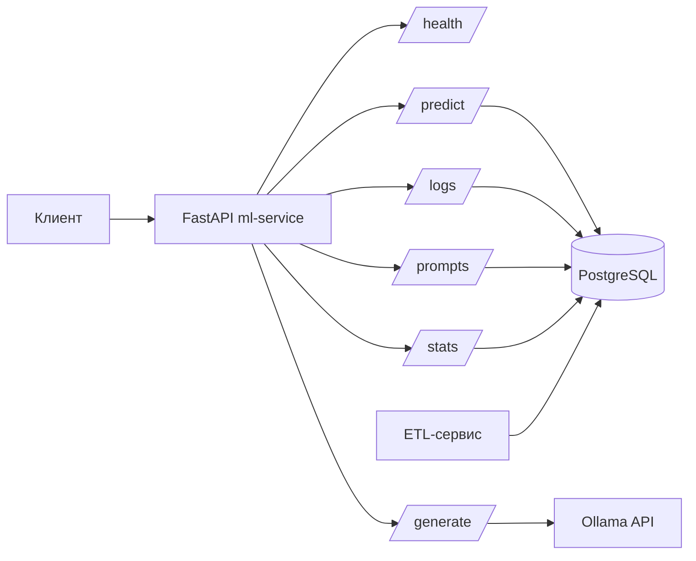

# ML Service v3

Версия **v3** сервиса машинного обучения на **FastAPI** с поддержкой:
- **Микросервисной архитектуры** — два независимых сервиса: **ml-service** (основной) и **etl** (сбор статистики).
- **Современного стека** — управление зависимостями через **uv** и `pyproject.toml` для каждого сервиса.
- **Логирования запросов** в PostgreSQL.
- **Генерации текста** через Ollama.

---

## Установка и запуск 

### Через Docker Compose (рекомендуемый способ)

```
docker-compose up --build
```

Сервис будет доступен по адресу: `http://localhost:8000`

### Локальный запуск (без Docker)

1. Установите **uv** (если не установлен):
```
pip install uv
```

2. Перейдите в директорию `ml-service`:
```
cd ml-service
```

3. Установите зависимости:
```
uv sync
```

4. Запустите сервер:
```
uv run uvicorn src.ml_service.main:app --reload
```

Для запуска ETL-сервиса отдельно:
```
cd etl
uv sync
uv run python src/etl/etl_service.py
```

### Запуск готового образа из GitHub Container Registry

```
docker pull ghcr.io/avandrevv/ml-service:latest
docker run -p 8000:8000 ghcr.io/avandrevv/ml-service:latest
```

> **Важно:** при запуске образа вручную требуется **запущенный PostgreSQL**. При локальном запуске FastAPI может работать без БД (логирование будет отключено).

---

## Переменные окружения

Создайте файл `.env` в корне проекта (или в каждой директории сервиса):

```
PGPASSWORD=your_password
```

---

## Эндпоинты API

| Метод | Путь | Описание |
|-------|------|----------|
| `GET` | `/health` | Проверка статуса сервиса |
| `POST` | `/predict` | Предсказание по входным признакам |
| `POST` | `/generate` | Генерация текста через Ollama |
| `GET` | `/logs` | Последние 10 записей логов |
| `GET` | `/prompts` | Получение истории prompt-запросов |
| `GET` | `/stats` | Статистика использования (ETL) |

### Примеры запросов

**/predict**

```
{
  "features": [5.1, 3.5, 1.4, 0.2]
}
```

Ответ:

```
{
  "prediction": 0,
  "confidence": 0.95,
  "processing_time_ms": 1.23
}
```

**/generate**

```
{
  "prompt": "Hi, I'm Andrew and how is your name",
  "model": "tinyllama"
}
```

Ответ:

```
{
  "model": "tinyllama",
  "response": "Hello Andrew! I am an AI assistant.",
  "done": true
}
```

---

## Тестирование

Для `ml-service`:
```
cd ml-service
uv run pytest tests/ -v
```

Для `etl` (если есть тесты):
```
cd etl
uv run pytest tests/ -v
```

---

## CI/CD

GitHub Actions автоматически:
- Запускает тесты при каждом пуше в ветку `master`.
- Собирает Docker-образ и публикует его в GitHub Container Registry.

---

## Структура проекта

```
.
├── ml-service/                        # Основной FastAPI-сервис
│   ├── src/
│   │   └── ml_service/                # Пакет приложения
│   │       ├── __init__.py
│   │       ├── main.py                # Точка входа
│   │       ├── database.py            # Подключение к БД
│   │       ├── schemas.py             # Pydantic-схемы
│   │       ├── urls.py                # Настройка роутинга
│   │       └── routers/
│   │           ├── db_routes.py       # /logs, /prompts, /stats
│   │           └── prompt_routes.py   # /predict, /generate
│   ├── tests/                         # Тесты
│   │   ├── healthcheck.py
│   │   ├── test_unit_generate.py
│   │   ├── test_unit_health.py
│   │   ├── test_unit_logs.py
│   │   └── test_unit_predict.py
│   ├── Dockerfile                     # Сборка сервиса
│   ├── pyproject.toml                 # Зависимости (uv)
│   ├── uv.lock
│   └── requirements.txt
├── etl/                               # ETL-сервис для сбора статистики
│   ├── src/
│   │   └── etl/
│   │       ├── __init__.py
│   │       └── etl_service.py
│   ├── Dockerfile.etl
│   ├── pyproject.toml
│   ├── uv.lock
│   └── requirements.txt
├── .github/workflows/                 # CI/CD пайплайны
├── model.joblib                       # Обученная модель
├── scaler.joblib                      # Scaler для предобработки
├── Dockerfile.ollama                  # Сборка Ollama
├── docker-compose.yml                 # Оркестрация всех сервисов
└── README.md
```

---

## Архитектура сервиса


```mermaid
graph LR
    A[Клиент] --> B[FastAPI ml-service]
    B --> C[/health/]
    B --> D[/predict/]
    B --> E[/generate/]
    B --> F[/logs/]
    B --> G[/prompts/]
    B --> H[/stats/]
    D --> I[(PostgreSQL)]
    F --> I
    G --> I
    H --> I
    E --> J[Ollama API]
    K[ETL-сервис] --> I
```

---

## Отличия от v2

- **Два независимых сервиса** — `ml-service` и `etl` разделены на уровне кода (каждый со своим `pyproject.toml`).
- **Современный стек** — управление зависимостями через **uv** и `pyproject.toml`.
- **Пакетная структура** — исходники лежат в `src/ml_service/` и `src/etl/`.
- **Тесты в отдельной папке** — `tests/` внутри `ml-service`.
- **Актуальные версии зависимостей** — фиксированные через `uv.lock`.
- **Docker-сборка с BuildKit** — оптимизированное кеширование.